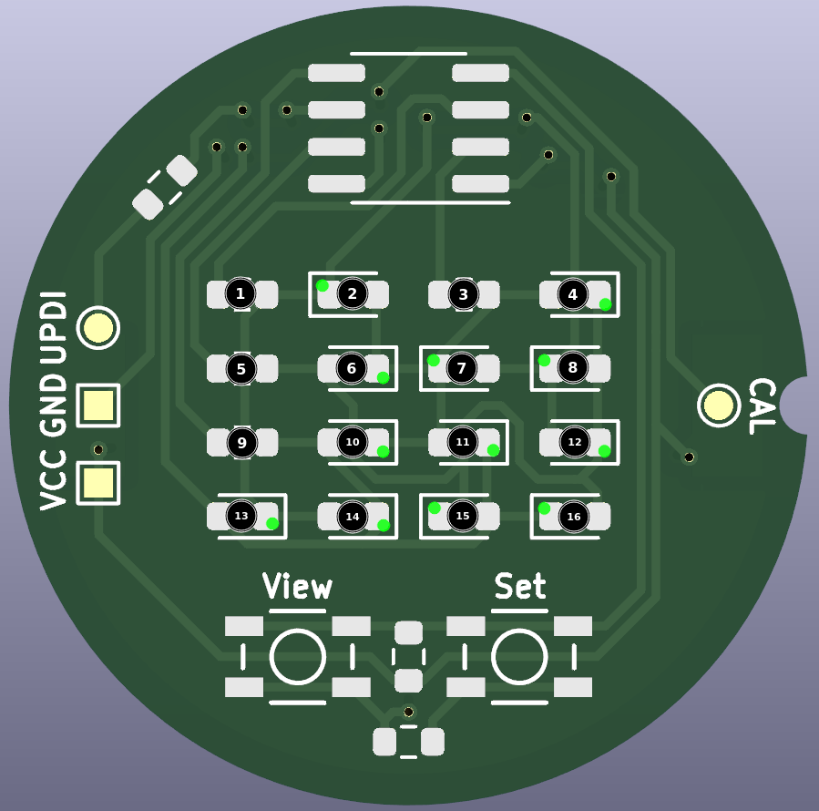
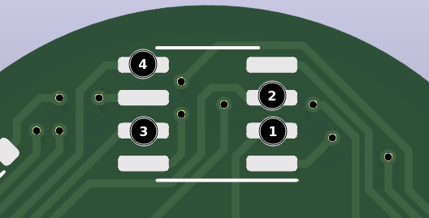
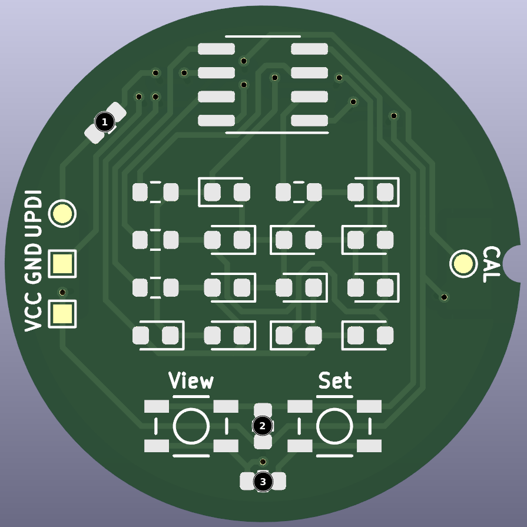

# Binary Watch

A 12 hour wrist watch that displays the current time in BCD using LEDs. The watch is powered by a single CR1216 coin cell and uses an ATtiny402 microcontroller to keep track of time and drive the LEDs. The time can be viewed or set at any time by pressing the two buttons on the face of the watch.

## Instructions

### Viewing the time

To view the time, simply press the `VIEW` button on the face of the watch. This will automatically wake the microcontroller and display the current time for 10 seconds. After 10 seconds, the LEDs will be turned off and the microcontroller will go back to sleep, conserving battery life.

### Setting the time

To set the time, first wake the watch from sleep by pressing the `VIEW` button. Once the watch is awake, press the `SET` button. The watch will now be in time setting mode, and the digit that is currently selected will flash once every two seconds. To change the value of the currently selected digit, press the `VIEW` button. Once the desired value is entered, press the `SET` button again to select the next digit and repeat until all digits are set. Once all digits are set, the watch will automatically return to view mode and go back to sleep after 10 seconds.

### Resetting the watch

To reset the watch, first wake the watch from sleep by pressing the `VIEW` button. Once the watch is awake, press and hold either button for at least three seconds. The watch will save the currently set time before resetting and will automatically return to view mode after the reset is complete.

## Design

Some trickery was needed to drive twelve LEDs and read two pushbuttons with the limitedf number of GPIO pins available. The LEDs are arranged in a [charlieplexing matrix](https://en.wikipedia.org/wiki/Charlieplexing), allowing all twelve LEDs to be controlled with just four tri-state GPIO pins. The pushbuttons are then read using a small resistor ladder with a single GPIO pin. Pressing the `VIEW` button will pull the voltage on the pin to `GND`, and pressing the `SET` button will pull the voltage on the pin to `0.5 * Vdd`. If no button is pressed, the voltage on the pin is pulled to `Vdd`. This way, only five GPIO pins are used and `PA0` is left to function solely as the UPDI pin, allowing for easy programming of the ATtiny402.

### Electronics BOM

| Description                | Count | Manufacturer Part Number | DigiKey Part Number  | Substitutions                                                                                |
| -------------------------- | ----- | ------------------------ | -------------------- | -------------------------------------------------------------------------------------------- |
| CR1216 coin cell holder    | 1     | BK-916-TR                | BK-916-CT-ND         | Substitutions are possible, but will require traces to be re-routed                          |
| Blue LED                   | 12    | IN-S63BT5B               | 1830-1068-1-ND       | Any other 0603 LED can be used, but if a different color is used the color will be different |
| 47Ω 1/8W Resistor          | 4     | ERJ-H3GJ470V             | 10-ERJ-H3GJ470VCT-ND | Any 0603, 47Ω resistor with a power rating of 1/8W or higher                                 |
| 4.7kΩ 1/8W Resistor        | 3     | ERJ-H3GJ472V             | 10-ERJ-H3GJ472VCT-ND | Any 0603, 4.7kΩ resistor with a power rating of 1/8W or higher                               |
| Momentary switch           | 2     | EVP-AA202K               | P13348SCT-ND         | Substitutions are possible, but will require traces to be re-routed                          |
| ATtiny 402 microcontroller | 1     | ATTINY402-SSNR           | ATTINY402-SSNRCT-ND  | Any ATtiny402. The ATtiny202 should also work, but has less flash and has not been tested.   |

### Mechanical BOM

| Description      | Count | Source                                   |
| ---------------- | ----- | ---------------------------------------- |
| Watch Body       | 1     | [CAD file](cad/watch-body.step)          |
| Watch Back       | 1     | [CAD file](cad/watch-back.step)          |
| PCB              | 1     | [Gerber files](pcb/gerbers.zip)          |
| CR1216 coin cell | 1     | Your favorite source for watch batteries |
| 15mm watch band  | 1     | Your favorite source for watch bands     |

## Assembly

### PCB

Unless you're lucky enough to have PCB fabrication facilities in house, you'll need to send the [Gerber files](pcb/gerbers.zip) to a third-party manufacturer for fabrication. I used [DKRed](https://www.digikey.com/en/resources/dkred) for my prototypes, but pretty much any other PCB manufacturer should be able to handle the PCB. If you're using a service with a clear solder mask like [OSH Park's After Dark](https://docs.oshpark.com/services/afterdark/), I recommend removing the ground plane on the front of the PCB for better aesthetics.

The components for the watch were picked to make hand soldering possible with a decent soldering iron and a steady hand, but it should also be possible to use a reflow oven or hot plate to solder the components on the face of the PCB. The battery holder will still likely need to be soldered by hand though, but it's nice and big so it shouldn't be too difficult. For hand soldering, I used the following procedure:

1.  Solder the LEDs and 47Ω resistors to the middle section of the PCB.

    - The resistors go in the spots with the two parallel silk screen lines (1, 3, 5, and 9 in Figure 1). These resistors aren't polarized, so they can be soldered in any orientation.
    - The LEDs go in the spots with the C-shaped silk screen lines around them (2, 4, 6, 7, 8, 10, 11, 12, 13, 14, 15, and 16 in Figure 1). The LEDs are polarized, so make sure to solder them in the correct orientation. If you use the LEDs specified in the BOM, the cathode will be marked with a tiny green dot. This green dot should be facing towards the C-shaped silk screen line. This orientation is also shown in Figure 1.

    

    _Figure 1_: LED and resistor placement

2.  Verify that the resistors and LEDs were placed correctly

    - Apply the positive and negative connections to a 3.3V source to the pads shown in Figure 2 using the table below. If everything is soldered correctly, the corresponding LED from Figure 1 should light up for every table entry.

    | Positive pad | Negative pad | LED |
    | ------------ | ------------ | --- |
    | 1            | 2            | 2   |
    | 1            | 3            | 11  |
    | 1            | 4            | 10  |
    | 2            | 1            | 7   |
    | 2            | 3            | 14  |
    | 2            | 4            | 12  |
    | 3            | 1            | 6   |
    | 3            | 2            | 13  |
    | 3            | 4            | 16  |
    | 4            | 1            | 4   |
    | 4            | 2            | 8   |
    | 4            | 3            | 15  |

    

    _Figure 2_: LED test pads

3.  Solder the 4.7kΩ resistors to the PCB

    - The three 4.7kΩ resistors go in the remaining spots with the two parallel silk screen lines (1, 2, and 3 in Figure 3). These resistors aren't polarized, so they can be soldered in any orientation.

    

    _Figure 3_: 4.7kΩ resistor placement

4.  Solder the buttons to the PCB

    - The buttons go above the silk screen labels reading `SW1` and `SW2`. The buttons aren't polarized, so they can be soldered in either direction

5.  Solder the ATtiny402 to the PCB

    - The ATtiny402 goes in the remaining spot on the front of the PCB with the small dimple or notch in the chip facing the center of the PCB

6.  Solder the battery holder to the PCB

    - Flip the PCB over and solder the battery holder to the four pads on the back

### Flashing

Three solder pads, labeled VCC, GND, and UPDI, are supplied on the watch face to allow for simple programming of the ATtiny using a UPDI programmer. Any UPDI programmer should work, but I used an Arduino Uno running [jtag2updi](https://github.com/ElTangas/jtag2updi/). The 4.7k series resistor required for flashing is already included on the PCB, so no external resistor is necessary.

1. Connect the VCC, GND, and UPDI solder pads to the corresponding pins using jumper wires. These jumper wires can be soldered or clipped on, it doesn't really matter. Note that the pads and traces are very small and fragile, so be careful not to put too much stress on them or they could rip off of the PCB.

   - The VCC pad should be connected to the 5V pin on the Arduino
   - The GND pad should be connected to the GND pin on the Arduino
   - The UPDI pad should be connected to the D6 on the Arduino

2. Hook the Arduino up to your PC and note what port it is connected to (eg, COM3, /dev/ttyACM0, /dev/ttyUSB0, etc). Set the `PORT` variable on line four of the [Makefile](Makefile) to this value, replacing the default value of `/dev/ttyACM0`

3. Run `make flash` to flash the watch. Alternatively, you can manually run the command `avrdude -c jtag2updi -P <YOUR_PORT> -p attiny402 -U flash:w:bin/main.hex -U eeprom:w:bin/eeprom.hex` to flash the watch.

4. The watch should automatically enter calibration mode after flashing. If you don't want to calibrate the watch right now, just hold down the `VIEW` button for at least three seconds to reset the watch.

### Calibration

After flashing the firmware, the watch will automatically enter one-time calibration mode. In this mode the watch will generate a square wave on the `CAL` solder pad, which can be measured using an oscilloscope. The period of this waveform should be as close to 468.75ms as possible, but it will initially be a good deal off from this value. To calibrate the watch, follow these steps:

1. Connect the `CAL` solder pad to the positive terminal of an oscilloscope probe using a jumper wire. Connect the negative terminal of the probe to the `GND` solder pad.
2. Measure the period of the generated square wave and compare it to the desired value of 468.75ms. 
    - If the measured period is to high, press the `VIEW` button to decrease the period.
    - If the measured period is to low, press the `SET` button to increase the period.
3. Repeat step 2 thirteen times. After the last repetition, the watch will automatically save the calibration value and restart into standard operation mode.

To prevent accidental re-calibration, the watch will only enter calibration mode immediately after flashing by default. If you want to enable entering calibration mode without flashing the watch, write the value `0x01` to EEPROM address `0x05`. This will allow the watch to enter calibration mode by holding down the `SET` button for at least three seconds. To disable this feature again, write the value `0x00` to EEPROM address `0x05`.

## Customization

The functionality of the watch can be customized by modifying, compiling, and flashing the [source code](src/main.c). For simple changes, the following configuration options can be modified in the [config.h](src/config.h) file:

| Option             | Description                                                                                                      | Default Value | Recommended Range | Units         |
| ------------------ | ---------------------------------------------------------------------------------------------------------------- | ------------- | ----------------- | ------------- |
| `BLINK_FREQUENCY`  | The frequency at which the currently selected digit will blink while in time setting mode                        | 1             | 0.25 - 2          | Hz            |
| `DEBOUNCE_COUNT`   | The number of consecutive update cycles that a button state must be stable before it is considered to be pressed | 50            | 5 - 500           | update cycles |
| `RESET_HOLD_TIME`  | The number of seconds that a button must be held before the watch is reset                                       | 3             | 1 - 10            | s             |
| `SLEEP_TIMEOUT`    | The number of seconds that the watch will remain awake before automatically going back to sleep                  | 10            | 1 - 60            | s             |
| `UPDATE_FREQUENCY` | The frequency at which the LED matrix is updated and input is read from the buttons.                             | 480           | 96 - 5000         | Hz            |

To compile the code, the avr-gcc tool chain will need to be installed with support for the ATtiny402

## License

This work is licensed under a [Creative Commons Attribution-NonCommercial 4.0 International License](https://creativecommons.org/licenses/by-nc/4.0). You are free to share, use, and modify this work for any non-commercial reasons as long as you give appropriate credit. The author grants permission for PCB and CAD design files to be sent to third-party manufacturers for fabrication as long as these fabricated parts or assemblies containing these fabricated parts are not later resold for profit.
